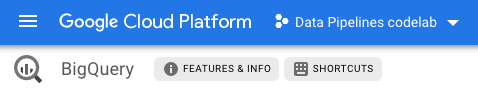

author: Jerry Jalava
summary: IoT Data Pipelines in GCP - Part 1
id: part1
categories: sdk
environments: js
status: draft
feedback link: https://github.com/jerryjj/iot-pipeline-codelabs/issues
<!-- analytics account: 0 -->

# IoT Data Pipelines in GCP - Part 1

## Overview
Duration: 2:00

Welcome to an introductory series to IoT Data pipelines in Google Cloud Platform.

In these Codelabs I assume that by now you already have a basic knowledge of Google Cloud Platform and its tooling.
You can read the [presentation slides](...) which I use before starting these labs in workshop, to get better idea of the products we are going to utilise in these Codelabs.

As an example we will be utilising a simplified version of an Electric Scooter with an IoT device in it.

In this example series we will focus on a use case, where our IoT device is sending us few triggered signals and periodical position and battery data. The simplest things you need to have to be able to follow the devices journey.

### What You’ll Learn in Part 1

- Setup a new Cloud Project
- how to set up Cloud Pub/Sub and test subscriptions
- how to set up BigQuery and prepare schema
- how to run queries in BigQuery against dummy data

Positive
: All the commands and the source code used for these labs, can be found in [Github](https://github.com/jerryjj/iot-pipelines-series)

### What kind of data are we handling

Before we continue, let's define some of our IoT devices data models.
In these Codelabs we assume our device talks to us in JSON format with following properties:

- “**d**”: Unique Device ID
- “**t**”: Epoch timestamp of when this event has occurred
- “**i**”: Unique Ride ID
- “**e**”: Name of the event/signal of particular payload
- “**b**”: Devices battery level in percentage
- “**l**”: Devices GPS coordinates
- “**p**”: Flag telling us if the device is powered on or not

Here are the samples of the different signals we will receive:

```json
{ "d": "0001", "t": "1566465608", "i": "abcd123", "e": "poweron", "b": 100, "l": "61.123456,24.123456", "p": 1 }
{ "d": "0001", "t": "1566465638", "i": "abcd123", "e": "gps", "b": 90, "l": "61.323456,24.323456", "p": 1 }
{ "d": "0001", "t": "1566465668", "i": "abcd123", "e": "poweroff", "b": 80, "l": "61.423456,24.423456", "p": 0 }
{ "d": "0001", "t": "1566465698", "i": null, "e": "gps", "b": 79, "l": "61.423456,24.423456", "p": 0 }
{ "d": "0002", "t": "1566465728", "i": null, "e": "alarm", "b": 50, "l": "61.423456,24.423456", "p": 0 }
```

What we can see from here is that we have 4 different signals we need to be able to handle,

- *PowerOn signals will be triggered every time the scooters ride is started.*
- *PowerOff signals will be triggered every time the scooters ride is ended.*
- *GPS update signals are triggered frequently when the device is Powered ON and less frequently when it is Idle.*
- *Alarm event gets triggered when the device is Powered Off, but it’s accelerometer is activated (device is moved or it fell down)*

Devices current battery level and latest location information is included in each of the message for simplicity in this case. There is also unique id generated for each PowerOn signal and it is sent with every signal until a PowerOff event occurs.

### Let's start

Without further ado, let’s start by preparing our project and setting up some of the common services we will be using during these Codelabs.

## Setup
Duration: 2:00

If you don't already have a Google Account (Gmail or G-Suite), you must [create one](https://accounts.google.com/SignUp).
New GCP users are eligible for a [$300 free trial](https://cloud.google.com/free/).

Next Sign-in to Google Cloud Platform console ([console.cloud.google.com](https://console.cloud.google.com/projectcreate)) and create a new project.

Positive
: You could create new cloud project using the command-line tools, but let's setup our project from the Google Cloud Console this time.


Few things to note here:

- Make a note of the **Project ID**, you will need it later.
- Choose a billing account
- The location can be left as is, or you can select an Organization or folder where you want the project to be created.

You may of course use your existing GCP Project if you want to, just use the **Project ID** of that one in the next step.

### Open Cloud Shell to your project

We will be utilising Cloud Shell during this codelab so you don't need to install any command-line tools to your working computer.

[Open in Cloud Shell and clone lab repository](https://ssh.cloud.google.com/cloudshell/editor?cloudshell_git_repo=https://github.com/jerryjj/iot-pipelines-series)

### Prepare common environment variables

Now before heading to the next part, set these environment variables to your terminal,
to choose a suitable region next to you, you can consult the [Locations information](https://cloud.google.com/compute/docs/regions-zones/#locations)
from Google Cloud documentation.

```sh
export GCP_PROJECT_ID=[use-your-project-id-here]
export GCP_REGION=europe-west1 # Select a region suitable to you
```

## Configuring Cloud Pub/Sub
Duration: 2:00

Now before we can start using Pub/Sub, we need to enable the API for it.
To do so, let's run the following command in our Cloud Shell:

```sh
gcloud services enable --project=$GCP_PROJECT_ID "pubsub.googleapis.com"
```

You should see a response similar to this:
`Operation "operations/acf.5862d95f-31fc-4d97-844c-6dd1fd855d27" finished successfully.`

### Create Pub/Sub topic

Now we can start utilising the product, so first thing we want to do is create a Topic.

Positive
: Remember, everything we do from the command-line can also be achieved from the Google Cloud Console UI.

To create a topic, let's store the name in our Environment so we can easily use it later, and use the gcloud utility to create the topic itself:

```sh
export PS_TOPIC_ID=device-signals

gcloud pubsub topics create $PS_TOPIC_ID \
--project $GCP_PROJECT_ID
```

You should see output similar to
`Created topic [projects/your-project-id/topics/device-signals].`

### Let's play with dummy data

Let's test our topic, by subscribing to it and sending test data to the topic.

First thing we need to do, is create a subscription to our topic:

```sh
gcloud pubsub subscriptions create test_subscription \
--topic $PS_TOPIC_ID \
--project $GCP_PROJECT_ID
```

Then let's send some dummy data to our topic:

```sh
gcloud pubsub topics publish $PS_TOPIC_ID \
--project $GCP_PROJECT_ID \
--message 'hello, pub/sub'
```

Then we can pull data out from our subscription:

```sh
gcloud pubsub subscriptions pull test_subscription \
--project $GCP_PROJECT_ID \
--auto-ack
```

Finally, we can delete our test subscription:

```sh
gcloud pubsub subscriptions delete test_subscription \
--project $GCP_PROJECT_ID
```

Important to note here, that if you publish something to your topic without any subscription,
there is no way for you to retrieve that data.
Also if you create multiple subscriptions to topic, both of those subscriptions will receive that published message.

You can try those combinations if you want to, using the same commands as before, but create two diffeewnt subscriptions to the same topic.
And if you want, create the test subscriptions from the [Cloud Console UI](https://console.cloud.google.com/cloudpubsub)

## Setup BigQuery
Duration: 2:00

So now we have the ability to receive data to our Pub/Sub topic, next we need to figure out how we are going to process and store that data. Before heading to the processing parts, let’s configure our storage.

### Lets enable the API

Again, before we can use this service, we need to enable the API for it:

```sh
gcloud services enable --project=$GCP_PROJECT_ID "bigquery-json.googleapis.com"
```

### Define our Dataset, Table and Schema

Let’s start by defining some environment variables again:

```sh
export BQ_DATASET_ID=devices
export BQ_TABLE_ID=signals
```

Then let’s define our table schema for by creating a following file `table-schema.json`:

```json
[
  {
    "name": "timestamp",
    "type": "TIMESTAMP"
  },
  {
    "name": "processing_timestamp",
    "type": "TIMESTAMP"
  },
  {
    "name": "event_name",
    "type": "STRING"
  },
  {
    "name": "device_id",
    "type": "STRING"
  },
  {
    "name": "ride_id", 
    "type": "STRING"
  },
  {
    "name": "battery_percentage",
    "type": "INTEGER"
  },
  {
    "name": "latitude",
    "type": "FLOAT"
  },
  {
    "name": "longitude",
    "type": "FLOAT"
  },
  {
    "name": "power_on_status",
    "type": "BOOL"
  }
]
```

In the Cloud Shell, you have a decent code editor in your disposal, so let's use that.
Create the file in the active directory as such:


Now we can create the Dataset and the Table

```sh
# Create Dataset in EU region
bq --project_id=$GCP_PROJECT_ID mk --data_location EU $BQ_DATASET_ID
```

Should output
`Dataset 'your-project-id:devices' successfully created.`

```sh
# Create our table using the defined schema
bq --project=$GCP_PROJECT_ID mk \
--display_name="devices signal data" \
--time_partitioning_type=DAY \
--time_partitioning_field=timestamp \
--table $BQ_DATASET_ID.$BQ_TABLE_ID table-schema.json
```

Should output
`Table 'your-project-id:devices.signals' successfully created.`

Positive
: Few things to note here, we defined the table schema in JSON format and named our fields a bit more descriptive. And as you can see we also included some fields that are not in our incoming data `latitude` and `longitude`. We will get to them on the next part of our series. We also defined the table to be partitioned by Day, this will give us benefits in the long run.

Negative
: NOTE: In this codelab we predefine our table schema as we know our input.
There is a way to achieve these same things without having any control about the incoming data structure, but that is outside the scope for now.

## Querying data
Duration: 5:00

Now before we move on to processing our data and storing it to our BigQuery, let’s test that we can answer some of the questions we want to ask from our data later on.

To do that we initialise some dummy data that fits our tables schema and run some test queries towards it.

Open new browser tab to [BigQuery Dashboard](https://console.cloud.google.com/bigquery).
Make sure your project is selected from the top menu:



Now let's past in a first part of our BigQuery query to the `Query Editor`:

```sql
WITH dummy_data AS (
  SELECT * FROM unnest(
    array<struct<device_id string, ride_id string, timestamp TIMESTAMP, event_name string, latitude float64, longitude float64, battery_percentage int64, power_on_status bool>>[
      ("0001", "123456", TIMESTAMP("2019-10-07 13:28:30.000 UTC"), "poweron", 60.1696993, 24.9294322, 88, true),
      ("0001", "123456", TIMESTAMP("2019-10-07 13:29:00.000 UTC"), "gps", 60.16962, 24.9288, 86, true),
      ("0001", "123456", TIMESTAMP("2019-10-07 13:29:30.000 UTC"), "gps", 60.16958, 24.92813, 84, true),
      ("0001", "123456", TIMESTAMP("2019-10-07 13:30:00.000 UTC"), "gps", 60.16969, 24.92074, 82, true),
      ("0001", "123456", TIMESTAMP("2019-10-07 13:30:30.000 UTC"), "poweroff", 60.1680235, 24.9222142, 81, false),
      ("0002", "123457", TIMESTAMP("2019-10-07 13:29:00.000 UTC"), "poweron", 60.1696993, 24.9294322, 20, true),
      ("0002", "123457", TIMESTAMP("2019-10-07 13:29:30.000 UTC"), "gps", 60.16962, 24.9288, 18, true),
      ("0002", "123457", TIMESTAMP("2019-10-07 13:30:00.000 UTC"), "gps", 60.16958, 24.92813, 14, true),
      ("0002", "123457", TIMESTAMP("2019-10-07 13:30:30.000 UTC"), "gps", 60.16969, 24.92074, 10, true),
      ("0002", "123457", TIMESTAMP("2019-10-07 13:32:00.000 UTC"), "poweroff", 60.1680235, 24.9222142, 4, false)
    ]
  )
),

-- Defines collection of ride start events from our data
starts AS (SELECT
  timestamp, device_id, ride_id rid, latitude lat, longitude lng, battery_percentage bttr
FROM dummy_data
WHERE
  event_name = "poweron"),

-- Defines collection of ride end events from our data
ends AS (SELECT
  timestamp, device_id, ride_id rid, latitude lat, longitude lng, battery_percentage bttr
FROM dummy_data
WHERE
  event_name = "poweroff"),

-- Defines collection of location update events from our data
location_updates AS (SELECT
  timestamp, device_id, ride_id rid, latitude lat, longitude lng, battery_percentage bttr
FROM dummy_data
WHERE
  event_name = "gps")

-- QUERY comes after this:
```

Here we initialise some dummy data that fits our tables schema and next we will run some test queries towards it.

So we want to get answers to at least the following questions at any point in time:
- *How many completed rides our devices have been on*
- *What kind of journey has the devices been on (with location trace)*
- *How many devices have low battery*
- *How many unique devices are there*
- *etc.*

Next we will do some queries to be able to answer these questions, I will not go too deep in explaining [BigQuery Query language](https://cloud.google.com/bigquery/docs/reference/standard-sql/query-syntax) at this point, but as you will see, it is just Standard SQL.

To be able to run these queries yourself, you need to attach the following query after the comment `-- QUERY comes after this:` and then run it.

### Test Queries

**Question 1**: *How many completes rides we have*

```sql
SELECT
  ANY_VALUE(starts.device_id) AS device,
  starts.rid, MIN(starts.timestamp) AS start_time, ANY_VALUE(starts.lat) AS start_lat, ANY_VALUE(starts.lng) AS start_lng,
  MAX(ends.timestamp) AS end_time, ANY_VALUE(ends.lat) AS end_lat, ANY_VALUE(ends.lng) AS end_lng,
  TIMESTAMP_DIFF(MAX(ends.timestamp), MIN(starts.timestamp), SECOND) AS duration_secs,
  (MAX(starts.bttr) - MIN(ends.bttr)) AS battery_usage_percent
FROM starts, ends
LEFT JOIN location_updates ON location_updates.rid = starts.rid
WHERE
  ends.rid = starts.rid
  AND location_updates.rid = starts.rid
GROUP BY rid
```

Once you paste that query after the initial one, you will get something like this:


And when you click the `Run`-button you should see results like these:


Great, so now we have a query which can answer us how many completed rides there has been with out devices.
To run the next queries, remember to delete the previous one until `-- QUERY comes after this:`-comment.

**Question 2**: *What is the battery level of certain device and when was it last seen*

```sql
SELECT
  device_id, timestamp AS last_seen, battery_percentage
FROM dummy_data
WHERE
  device_id = '0001'
ORDER BY timestamp DESC
LIMIT 1
```

**Question 3**: *From how many unique devices we have received a signal certain month (October)*

```sql
,params AS (
  SELECT
    '2019-10' AS search_month
)
SELECT
  COUNT(DISTINCT(device_id)) AS devices
FROM params, dummy_data
WHERE
  FORMAT_TIMESTAMP('%Y-%m', timestamp) = params.search_month
```

### Visualize data

To test a simple visualisation, let’s use a tool called BigQuery Geo Viz. Open new browser tab to [https://bigquerygeoviz.appspot.com/](https://bigquerygeoviz.appspot.com/), select your **Project ID** from the dropdown and paste in the following query:

```sql
WITH dummy_data AS (
  SELECT * FROM unnest(
    array<struct<device_id string, ride_id string, timestamp TIMESTAMP, event_name string, latitude float64, longitude float64, battery_percentage int64, power_on_status bool>>[
      ("0001", "123456", TIMESTAMP("2019-10-07 13:28:30.000 UTC"), "poweron", 60.1696993, 24.9294322, 88, true),
      ("0001", "123456", TIMESTAMP("2019-10-07 13:29:00.000 UTC"), "gps", 60.16962, 24.9288, 86, true),
      ("0001", "123456", TIMESTAMP("2019-10-07 13:29:30.000 UTC"), "gps", 60.16958, 24.92813, 84, true),
      ("0001", "123456", TIMESTAMP("2019-10-07 13:30:00.000 UTC"), "gps", 60.16969, 24.92074, 82, true),
      ("0001", "123456", TIMESTAMP("2019-10-07 13:30:30.000 UTC"), "poweroff", 60.1680235, 24.9222142, 81, false),
      ("0002", "123457", TIMESTAMP("2019-10-07 13:29:00.000 UTC"), "poweron", 60.1796993, 24.9394322, 20, true),
      ("0002", "123457", TIMESTAMP("2019-10-07 13:29:30.000 UTC"), "gps", 60.17962, 24.9388, 18, true),
      ("0002", "123457", TIMESTAMP("2019-10-07 13:30:00.000 UTC"), "gps", 60.17958, 24.93813, 14, true),
      ("0002", "123457", TIMESTAMP("2019-10-07 13:30:30.000 UTC"), "gps", 60.17969, 24.93074, 10, true),
      ("0002", "123457", TIMESTAMP("2019-10-07 13:32:00.000 UTC"), "poweroff", 60.1780235, 24.9322142, 4, false)
    ]
  )
)
SELECT
  FORMAT_TIMESTAMP("%Y-%m-%dT%X%Ez", timestamp) as ts, event_name, device_id, ST_GeogPoint(longitude, latitude) AS wkt
FROM dummy_data
WHERE
  ride_id = "123456"
ORDER BY timestamp DESC
```

Then click, `Run` and `See Results` buttons, you will be redirected to review the results, the defaults should be fine (`Geometry column` should have `wkt` as value), go ahead and click `Add styles`.
Here we want to distinguish our waypoints with different colors so we now what the points on the map mean. To do this change the **fillColor** settings to match something like this:


After that we can see our GPS points on the map and colored based on their event, how nice is that!


## End of Part 1

Now we have setup our Pub/Sub topic and BigQuery as our Data Warehouse.
In the next Codelab we start to ingest some data from our devices.

You are now ready to head over to [Part 2](/part2)

Negative
:You don't need to do any project cleanup at this point if you are continuing to the next lab.
Otherwise you may just delete the project from the Cloud Console and it will delete all the resources we have do so far.
