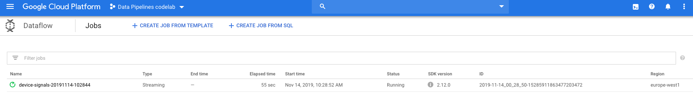
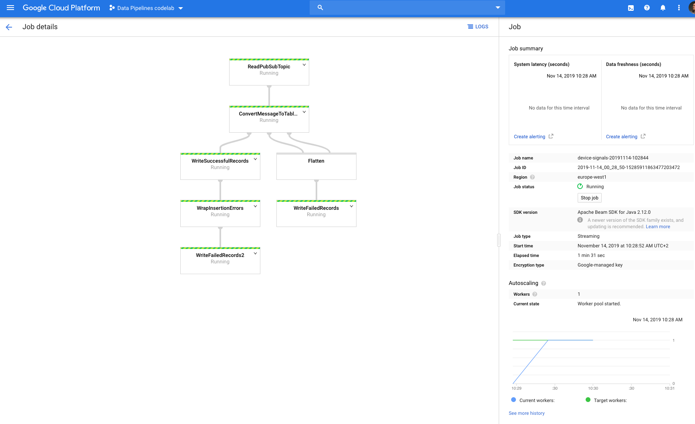
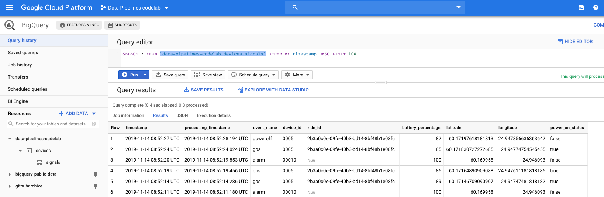
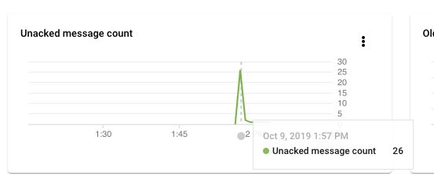

author: Jerry Jalava
summary: IoT Data Pipelines in GCP - Part 2
id: part2
categories: sdk
environments: js
status: draft
feedback link: https://github.com/jerryjj/iot-pipeline-codelabs/issues
<!-- analytics account: 0 -->

# IoT Data Pipelines in GCP - Part 2

## Overview
Duration: 0:30

Welcome to the part 2 of the Codelab series.
In the previous part we setup our Google Cloud Project with Cloud Pub/Sub and BigQuery.

In this lab we start to actually ingest some real-time data to transform and store it into our BigQuery table.

In this lab we will be using product called [Cloud Dataflow](https://cloud.google.com/dataflow/) to accomplish this.

Positive
: Cloud Dataflow is a fully-managed service for transforming and enriching data in stream (real time) and batch (historical) modes with equal reliability and expressiveness — no more complex workarounds or compromises needed. And with its serverless approach to resource provisioning and management, you have access to virtually limitless capacity to solve your biggest data processing challenges, while paying only for what you use.

And to save us the hassle of actually writing our own Beam flow in Java or Python, we are going to utilize [a premade template](https://cloud.google.com/dataflow/docs/guides/templates/provided-templates) from Google and use our custom DST transformer to handle the data transformation.

Positive
: Cloud Dataflow templates allow you to stage your pipelines on Cloud Storage and [run them](https://cloud.google.com/dataflow/docs/templates/executing-templates) from a variety of environments.
Google provides a set of [open-source Cloud Dataflow templates](https://github.com/GoogleCloudPlatform/DataflowTemplates).

### What You’ll Learn in Part 2

- Use Cloud Dataflow as data processor
- How to use custom UDF (User-Defined Function) in Dataflow template

Without further ado, let's start!

## Setup

Before we can continue, make sure you have the same Cloud Shell instance running as in the previous part,
with the environment variables still in place we defined earlier.

Let's start by defining some new variable which we are going to need in this and next lab.

```sh
export GCP_ZONE=$GCP_REGION-b # choose a zone from selected region
export BUCKET_NAME=$GCP_PROJECT_ID-dataflow
export PIPELINE_FOLDER=gs://${BUCKET_NAME}/devices
```

In the previous lab we configured our GCP Region, now we also need to define a zone from that Region,
again you should to choose an available zone from your region, you can consult the [Locations information](https://cloud.google.com/compute/docs/regions-zones/#locations) from Google Cloud documentation.

And as we did previously, again we need to enable the proper services to be able to use Dataflow (this will take a while):

```sh
ENABLE_APIS=(
"storage-api.googleapis.com" \
"dataflow.googleapis.com"
)

gcloud services enable --project=$GCP_PROJECT_ID ${ENABLE_APIS[@]}
```

Now let's create a [Cloud Storage](https://cloud.google.com/storage/) bucket, which will hold our Dataflow
related objects.

```sh
# If your region is outside EU, change accordingly
gsutil mb -p $GCP_PROJECT_ID -l eu gs://$BUCKET_NAME
```

As a Dataflow template, we will be utilising [this one](https://cloud.google.com/dataflow/docs/guides/templates/provided-streaming#cloud-pubsub-topic-to-bigquery) which allows us to subscribe to existing Cloud Pub/Sub topic and 
read incoming messages as a stream and then write them to BigQuery.

First, let's define our UDF which will handle the transformation of incoming data to match our BigQuery table schema.

Let's create a new file (using the Cloud Shell code editor) called `udf.js`:

```js
/**
 * A transforms incoming device signal event to BQ schema event
 * @param {string} inJson
 * @return {string} outJson
 */
function transformDeviceSignalEvent(inJson) {
  var original = JSON.parse(inJson)

  var now = new Date()

  var locationParts = original.l.split(',')

  var transformed = {
    timestamp: new Date(original.t * 1000),
    processing_timestamp: now,
    event_name: original.e,
    device_id: original.d,
    ride_id: original.i,
    battery_percentage: original.b,
    latitude: parseFloat(locationParts[0]) || 0.0,
    longitude: parseFloat(locationParts[1]) || 0.0,
    power_on_status: Boolean(original.p)
  }

  return JSON.stringify(transformed)
}
```

Then we will copy this file to our Cloud Storage bucket:

```sh
gsutil cp udf.js $PIPELINE_FOLDER/udf.js
```

That's it for the setup, next we will start the pipeline.

## Running the pipeline

Now we are ready to launch our pipeline in Dataflow, once we execute the following command, the pipeline will create a Subscription to our Pub/Sub topic and start listening for incoming messages, parse them and store them to BigQuery.

```sh
JOB_NAME=device-signals-`date +"%Y%m%d-%H%M%S"`

gcloud dataflow jobs run $JOB_NAME \
--project=$GCP_PROJECT_ID \
--region $GCP_REGION --zone $GCP_ZONE \
--gcs-location gs://dataflow-templates/2019-07-10-00/PubSub_to_BigQuery \
--parameters \
"inputTopic=projects/$GCP_PROJECT_ID/topics/$PS_TOPIC_ID,\
outputTableSpec=$GCP_PROJECT_ID:$BQ_DATASET_ID.$BQ_TABLE_ID,\
outputDeadletterTable=$GCP_PROJECT_ID:$BQ_DATASET_ID.${BQ_TABLE_ID}_deadletter,\
javascriptTextTransformFunctionName=transformDeviceSignalEvent,\
javascriptTextTransformGcsPath=$PIPELINE_FOLDER/udf.js"
```

You should see similar output:

```sh
createTime: '2019-11-14T08:28:52.175834Z'
currentStateTime: '1970-01-01T00:00:00Z'
id: 2019-11-14_00_28_50-15285911863477203472
location: europe-west1
name: device-signals-20191114-102844
projectId: data-pipelines-codelab
startTime: '2019-11-14T08:28:52.175834Z'
type: JOB_TYPE_STREAMING
```

Now we can go to the [Dataflow dashboard](https://console.cloud.google.com/dataflow) in the GCP Console to monitor the pipeline setup.

You should see your job in the listing:


And when you select your job, you should see the outline of the pipeline and statistics about it:


Now as you can see there are the minimum amount of Virtual Machines already running and waiting for data, even though there is no data available in the Pub/Sub topic.

In the next step we will give the pipeline something to process.

## Simulate IoT data

Let’s give the pipeline something to do and launch our Device simulator to start sending some data to our Pub/Sub topic.
When we started Cloud Shell in the Part 1, we also cloned a repository to our Cloud Shell environment.
You should already be in the folder called `iot-pipelines-series`, if not navigate there.

### Setup credentials

Before we can run our simulator, we need to be able to send data to our Cloud Pub/Sub topic from the cloud shell.
For this we will need a Service Account that has the permissions to publish messages to topics.

So let's create a service account with a private key, which have write access to our Pub/Sub topics.

```sh
KEY_NAME="ps-secret-key"

gcloud iam service-accounts create $KEY_NAME \
--project=$GCP_PROJECT_ID \
--display-name $KEY_NAME

gcloud pubsub topics add-iam-policy-binding $PS_TOPIC_ID \
--project=$GCP_PROJECT_ID \
--member serviceAccount:$KEY_NAME@$GCP_PROJECT_ID.iam.gserviceaccount.com \
--role roles/pubsub.publisher

gcloud iam service-accounts keys create \
--project=$GCP_PROJECT_ID \
--key-file-type json \
--iam-account $KEY_NAME@$GCP_PROJECT_ID.iam.gserviceaccount.com \
./secrets/$KEY_NAME.json
```

It should end with similar output
`created key [eff5b28edc19404ffa05aff887ec68ad88abf659] of type [json] as [./secrets/ps-secret-key.json] for [ps-secret-key@data-pipelines-codelab.iam.gserviceaccount.com]`

### Prepare and run simulator

Inside that folder there is a folder called simulator, that is a Device simulator written in Node.js which we will be using through out these labs.

First we need to prepare our simulator to be able to run it, to do so run the following commands:

```sh
cd simulator/
npm install
```

Then we can launch our simulator with 10 Devices in Helsinki, Finland:

```sh
DEVICE_COUNT=10 node src/index.js
```

You should start seeing some debug output of the devices sending different signals towards our pipeline.
And if you go back to your GCP console’s [Dataflow dashboard](https://console.cloud.google.com/dataflow), you should see your steps are now processing data.

## Query the data

Now head over your [BigQuery dashboard](https://console.cloud.google.com/bigquery) and execute the following query to see the latest 100 items in your database (replace your Project ID)

```sql
SELECT * FROM `YOUR_PROJECT_ID.devices.signals` ORDER BY timestamp DESC LIMIT 100
```

You should see similar results:


Wonderful! You now have a streaming Dataflow pipeline to process data from your device all the way to your BigQuery table.

Click around the Cloud Console UI and view the Dataflow logs and checkout the Pub/Sub topic and subscription views, to get familiar with other settings.

When you check your Cloud Pub/Sub subscription Dashboard you might see a spike of unacknowledged messages. This happens because our simulator was sending events to the topic, but the Dataflow wasn’t yet ready to start reading them from the subscription.


And as you can see, once the pipeline was ready, it pulled all the older messages and processed them.

## Cleanup

Remember to stop your Dataflow pipeline so it won’t continue to incur charges.
To do so, stop your simulator (CTRL-C) running in the Cloud Shell and then run the following commands:

```sh
JOB_ID=$(gcloud --project $GCP_PROJECT_ID dataflow jobs list --region $GCP_REGION --status active --filter=name:device --format="value(id)")

gcloud --project $GCP_PROJECT_ID dataflow jobs drain --region $GCP_REGION $JOB_ID
```

You should see output similar to
`Started draining job [2019-11-14_00_28_50-15285911863477203472]`

Negative
: Pricing of Dataflow is based on the selected Machine Type, Maximum amount of Workers, Disk size, etc. and this pipeline (with defaults) would have incurred approximate cost of 256-768 USD/month depending on data volume.

This concludes our Part 2 of the labs, in the next lab we will build the pipeline a bit differently using Cloud Functions.

You are now ready to head over to Part 3.
