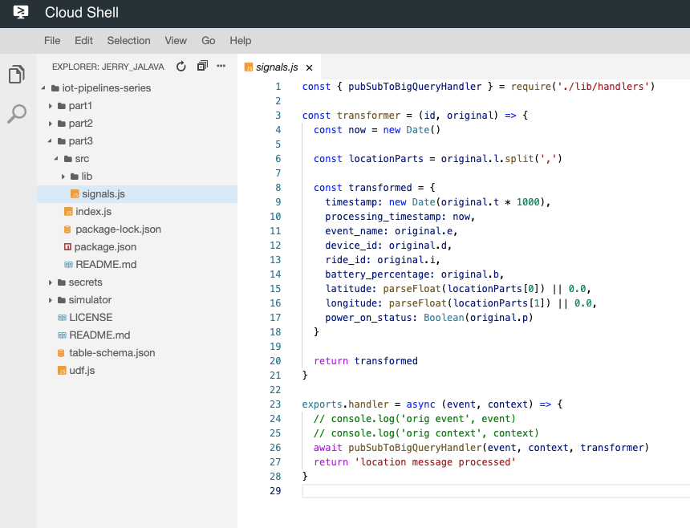
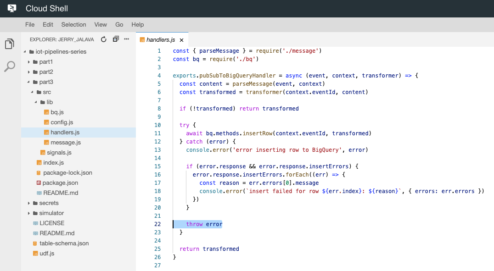
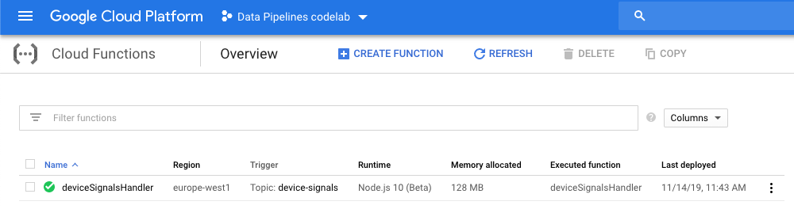
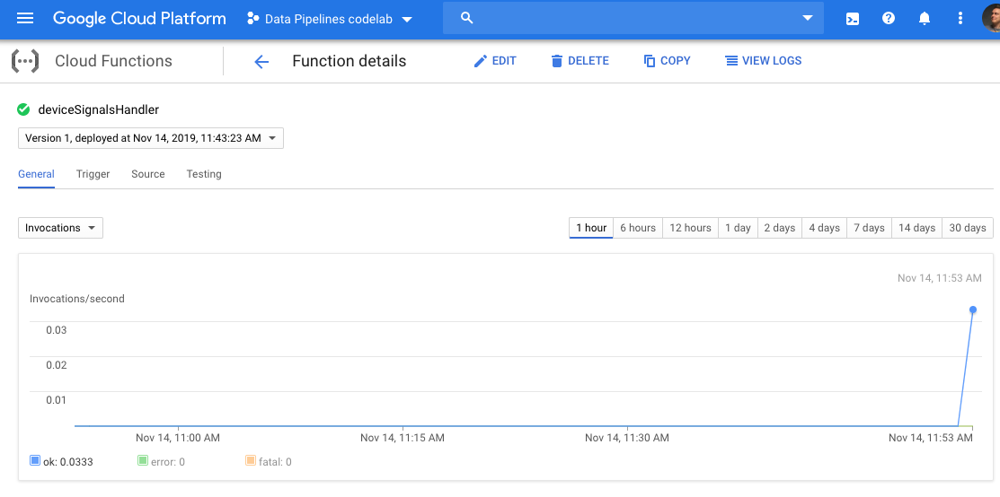
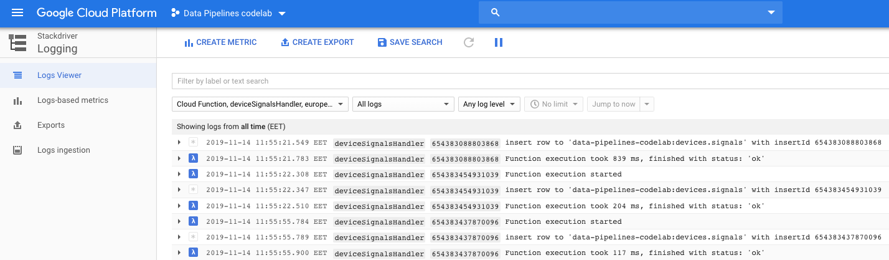
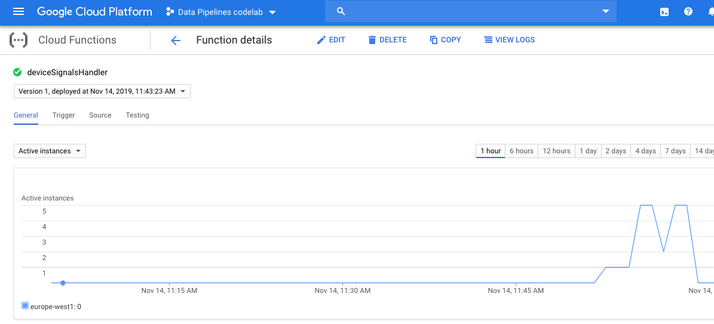
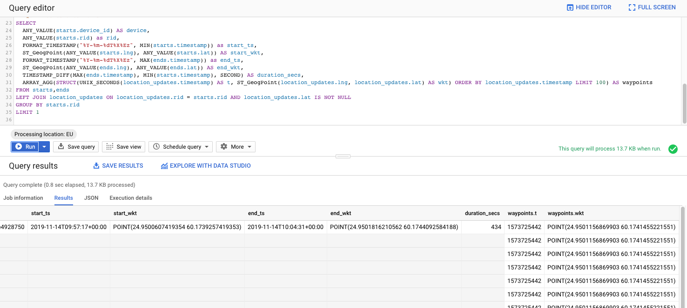
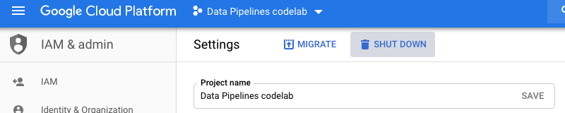

author: Jerry Jalava
summary: IoT Data Pipelines in GCP - Part 3
id: part3
categories: sdk
environments: js
status: draft
feedback link: https://github.com/jerryjj/iot-pipeline-codelabs/issues
<!-- analytics account: 0 -->

# IoT Data Pipelines in GCP - Part 3

Welcome to Part 3 of the Codelab series.

## Overview
Duration: 0:30

Welcome to the part 3 of the Codelab series.
In the previous parts we have configured a Pub/Sub topic to receive information from our IoT devices and setup a BigQuery table to receive that information. We also used Dataflow to ingest, transform and store that data to our BigQuery table.

In this part we will use [Google Cloud Functions](https://cloud.google.com/functions/) to do the Ingestion, Transformation and Storing to BigQuery.

Positive
: Google Cloud Functions is a lightweight compute solution for developers to create single-purpose, stand-alone functions that respond to Cloud events without the need to manage a server or runtime environment.

Let’s dig right in. We will be using Node.js v10 runtime (beta) for our function in this article, but you could write them in any of the supported languages.
And for this example we will also be using the new [functions-framework](https://cloud.google.com/functions/docs/functions-framework) from Google Cloud team.

We will be using background functions as we want the function to be invoked indirectly in response to a message coming to our Cloud Pub/Sub topic.
The big difference with this compared to the Dataflow usage we did in the Part 2, is that GCF will scale to zero if there is no traffic. So you only pay for what you use, as ooposed in the Dataflow case which currently doesn’t support scaling to zero.

### What You’ll Learn in Part 3

- Use Cloud Functions as data processor

Without further ado, let's start!

## Setup

Before we can continue, make sure you have the same Cloud Shell instance running as in the previous part,
with the environment variables still in place we defined earlier.

And as we did previously, again we need to enable the proper services to be able to use Cloud Functions:

```sh
gcloud services enable --project=$GCP_PROJECT_ID "cloudfunctions.googleapis.com"
```

In your Cloud Shell, you should now be in the folder called `iot-pipelines-series`,
if not navigate there (`cd ~/iot-pipelines-series`).

### Create Service Account for our Cloud Function

We want to create a custom service account for our GCF which has limited access to our project.
We could limit the access even more, but for simplicity this will do.

```sh
KEY_NAME="pipeline-handlers-sa"

gcloud iam service-accounts create $KEY_NAME \
--project=$GCP_PROJECT_ID \
--display-name $KEY_NAME

gcloud projects add-iam-policy-binding $GCP_PROJECT_ID \
--project=$GCP_PROJECT_ID \
--member serviceAccount:$KEY_NAME@$GCP_PROJECT_ID.iam.gserviceaccount.com \
--role roles/bigquery.dataEditor
```

Negative
: This time we do not need to generate and download a private key to our service account, unless we wan't to test our function locally.

## Inspecting function source and deploying it

Before we launch our function, let's take a look at the important parts.
Using the Cloud Shell code editor, open file `part3/src/signals.js`:



In this file we define our transformation logic before we store the data to BigQuery.
As you can find out it is exactly the same we used previously in our Dataflow example.

If we take a look at our `part2/src/lib/handlers.js` -file, note that if we receive an error
while writing to BigQuery we throw it, this will trgger the function to be retried again with the same payload.



And to protect ourselves from getting accidental duplicates of the same Pub/Sub message to our BigQuery we use the Pub/Subs unique eventId as our writeId to BigQuery.

To learn more about retries, error cases and idempotent cloud function designing I suggest these good articles:
[Retrying Background Functions](https://cloud.google.com/functions/docs/bestpractices/retries) & [Building Idempotent Functions](https://cloud.google.com/blog/products/serverless/cloud-functions-pro-tips-building-idempotent-functions).

### Deploying the function

To deploy the function we need to navigate in our Cloud Shell to the function source
`cd ~/iot-pipelines-series/part3`.

And then to deploy it, run the following command (this will take a while):

```sh
gcloud functions deploy deviceSignalsHandler \
--project $GCP_PROJECT_ID \
--runtime nodejs10 \
--region $GCP_REGION \
--service-account pipeline-handlers-sa@$GCP_PROJECT_ID.iam.gserviceaccount.com \
--set-env-vars BQ_PROJECT_ID=$GCP_PROJECT_ID,BQ_DATASET_ID=devices,BQ_TABLE_ID=signals \
--trigger-topic $PS_TOPIC_ID \
--allow-unauthenticated \
--memory=128 \
--retry
```

After the deployment is finished, let’s go take a look from the [Functions Dashboard](https://console.cloud.google.com/functions/list).



## Simulate IoT data and monitor the function

Let’s give the pipeline something to do and launch our Device simulator to start sending some data to our Pub/Sub topic.
When we started Cloud Shell in the Part 1, we also cloned a repository to our Cloud Shell environment.
Again, navigate to out simulator folder `cd ~/iot-pipelines-series/simulator`.

Let's launch our simulator with 20 Devices in Helsinki, Finland:

```sh
DEVICE_COUNT=20 node src/index.js
```

While the simulator is running, let's monitor our function from the dashboard.
In your Functions Dashboard navigate to the function details view and see the Invocations chart.



You can also change the chart to `Active Instances` to see how many instances of your function is currently running.
Now navigate to the Function Logs, by clicking the `View Logs` button on top of the page.
You can press the "Play" -button to see the processing logs real-time.



Now let's stop our simulator (CTRL+C) and see what happens to our functions `Active Instances` count.



After a while it will be scaled down to 0 instances. This is great news, you don’t have to pay for idle functions if you are not receiving any data.

### Receiving data, but no function yet deployd

What would happen if our function wouldn’t be deployed but our devices are still sending information?

Answer is that **your signals would be lost!**

Reason for this is that Cloud Pub/Sub doesn’t send old messages to new Subscriptions. And because the GCF creates new subscription for the function when deployed, there is no one listening for your incoming signals before.
However, updating your function does not have the same effect, so you are safe to update your functions even though the data is still streaming in.

### Pricing

Cloud Functions are priced according to how long your function runs, how many times it’s invoked and how many resources you provision for the function. If your function makes an outbound network request, there are also additional data transfer fees.

Positive
: If we imagine that we would get constantly 10 messages/second, 24h/day, 30 days/month (26 Million invocations), then this pipeline would have incurred approximate cost of 71 USD/month.

## Lets' check on our data

To see what kind of data we managed to ingest during these two Labs
Open a new browser tab to [BigQuery Dashboard](https://console.cloud.google.com/bigquery).

Paste in the following query (replace your Project ID) to the `Query Editor`

```sql
-- Defines collection of ride start events from our data
WITH starts AS (SELECT
  timestamp, device_id, ride_id rid, latitude lat, longitude lng, battery_percentage bttr
FROM `YOUR_PROJECT_ID.devices.signals`
WHERE
  event_name = "poweron"),

-- Defines collection of ride end events from our data
ends AS (SELECT
  timestamp, device_id, ride_id rid, latitude lat, longitude lng, battery_percentage bttr
FROM `YOUR_PROJECT_ID.devices.signals`
WHERE
  event_name = "poweroff"),

-- Defines collection of location update events from our data
location_updates AS (SELECT
  timestamp, device_id, ride_id rid, latitude lat, longitude lng, battery_percentage bttr
FROM `YOUR_PROJECT_ID.devices.signals`
WHERE
  event_name = "gps")

-- QUERY comes after this:
```

Then run these queries to answer similar questions we did on Part 1 (you need to attach the following query after the comment `-- QUERY comes after this:` and then run it).

### Test Queries

**Question 1**: *How many completed rides we have*

```sql
SELECT
  ANY_VALUE(starts.device_id) AS device,
  starts.rid, MIN(starts.timestamp) AS start_time, ANY_VALUE(starts.lat) AS start_lat, ANY_VALUE(starts.lng) AS start_lng,
  MAX(ends.timestamp) AS end_time, ANY_VALUE(ends.lat) AS end_lat, ANY_VALUE(ends.lng) AS end_lng,
  TIMESTAMP_DIFF(MAX(ends.timestamp), MIN(starts.timestamp), SECOND) AS duration_secs,
  (MAX(starts.bttr) - MIN(ends.bttr)) AS battery_usage_percent
FROM starts, ends
LEFT JOIN location_updates ON location_updates.rid = starts.rid
WHERE
  ends.rid = starts.rid
  AND location_updates.rid = starts.rid
GROUP BY rid
```

**Question 2**: *Get a ride and all its GPS waypoints*

```sql
SELECT
  ANY_VALUE(starts.device_id) AS device,
  ANY_VALUE(starts.rid) as rid,
  FORMAT_TIMESTAMP("%Y-%m-%dT%X%Ez", MIN(starts.timestamp)) as start_ts,
  ST_GeogPoint(ANY_VALUE(starts.lng), ANY_VALUE(starts.lat)) AS start_wkt,
  FORMAT_TIMESTAMP("%Y-%m-%dT%X%Ez", MAX(ends.timestamp)) as end_ts,
  ST_GeogPoint(ANY_VALUE(ends.lng), ANY_VALUE(ends.lat)) AS end_wkt,
  TIMESTAMP_DIFF(MAX(ends.timestamp), MIN(starts.timestamp), SECOND) AS duration_secs,
  ARRAY_AGG(STRUCT(UNIX_SECONDS(location_updates.timestamp) AS t, ST_GeogPoint(location_updates.lng, location_updates.lat) AS wkt) ORDER BY location_updates.timestamp LIMIT 100) AS waypoints
FROM starts,ends
LEFT JOIN location_updates ON location_updates.rid = starts.rid AND location_updates.lat IS NOT NULL
GROUP BY starts.rid
LIMIT 1
```

You will receive something like this



## Cleanup

Thats it, you now know how to build Data Pipelines in two different ways.

Let's remove our function as we don't need it anymore.
Run the following command in your Cloud Shell:

```sh
gcloud functions delete deviceSignalsHandler \
--project $GCP_PROJECT_ID \
--region $GCP_REGION
```

At this point you can also clean up our whole project if you don't need it anymore.

One way to do this, is to just delete the whole project from the Cloud Console (or from command-line).
Navigate to [IAM & Admin -> Settings](https://console.cloud.google.com/iam-admin/settings) in your Cloud Console
and click the `Shut down` -button. This will remove the project and all resources inside it.


